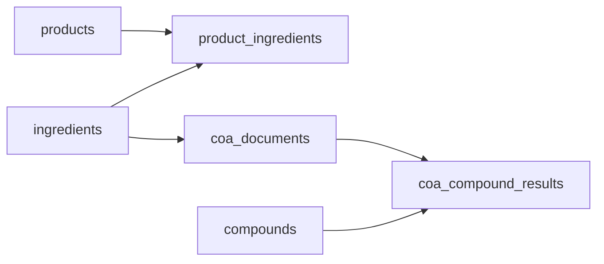

# Terproduct

**Terpedia** product catalog: **products → ingredients → CoA (certificate of analysis) → compound results**.

Live site: [terproduct.terpedia.com](https://terproduct.terpedia.com) (after DNS and hosting are pointed).

## Repository

- GitHub: [Terpedia/terproduct](https://github.com/Terpedia/terproduct)

## Data model

| Layer | Role |
| --- | --- |
| **products** | Finished goods (name, slug, brand). |
| **ingredients** | Materials; linked to products via **product_ingredients**. |
| **coa_documents** | Lab reports for an ingredient (batch/lot, lab, dates, file URL). |
| **compounds** | Canonical analytes (name, CAS, category). |
| **coa_compound_results** | Measured values per CoA and compound (value, unit, ND flags). |

PostgreSQL migration: `supabase/migrations/20260418000000_initial_schema.sql`.  
TypeScript types: `lib/domain.ts`.



## Development

```bash
npm install
npm run dev
```

Open [http://localhost:3000](http://localhost:3000).

```bash
npm run build
npm run lint
```

## Cloudflare: `terproduct.terpedia.com`

In the Cloudflare dashboard for **terpedia.com** → **DNS** → **Records**:

1. Add a **CNAME** record:
   - **Name:** `terproduct`
   - **Target:** your hosting hostname (for example Cloudflare Pages `terproduct.pages.dev`, or the domain your provider gives for Vercel/Netlify).
   - **Proxy status:** Proxied (orange cloud) unless your host requires DNS-only.

2. If you use **Cloudflare Pages** with a custom domain, add `terproduct.terpedia.com` under the Pages project → **Custom domains** so TLS is issued.

### API alternative (token required)

With `CLOUDFLARE_API_TOKEN` (Zone → DNS → Edit) and zone ID for `terpedia.com`:

```bash
curl -sS -X POST "https://api.cloudflare.com/client/v4/zones/$CLOUDFLARE_ZONE_ID/dns_records" \
  -H "Authorization: Bearer $CLOUDFLARE_API_TOKEN" \
  -H "Content-Type: application/json" \
  --data '{"type":"CNAME","name":"terproduct","content":"YOUR_HOSTNAME","proxied":true}'
```

Replace `YOUR_HOSTNAME` with the target from your host (Pages, Vercel, etc.).

## Deploy

Connect **Terpedia/terproduct** to Cloudflare Pages, Vercel, or another Node host; set the production URL to `https://terproduct.terpedia.com` in the host’s project settings after DNS is live.
