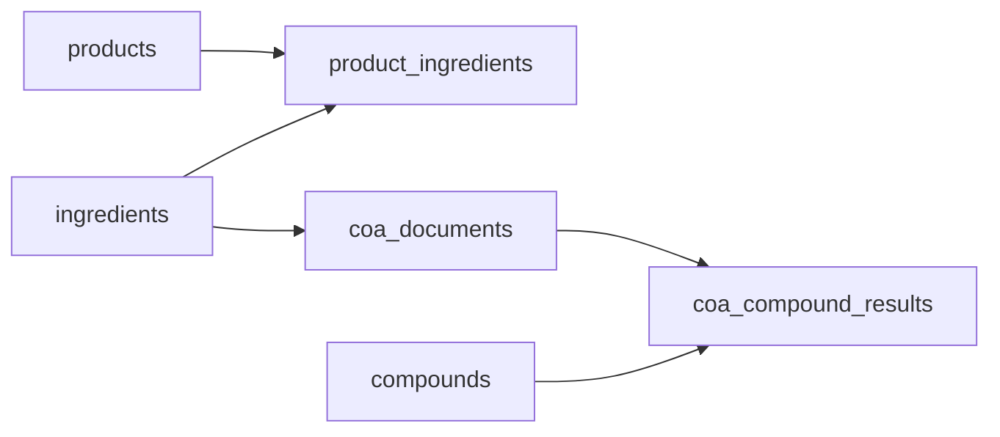

# Terproduct

**Terpedia** product catalog: **products → ingredients → CoA (certificate of analysis) → compound results**.

Live site: [terproduct.terpedia.com](https://terproduct.terpedia.com) (after DNS and hosting are pointed).

**GitHub Pages (project site):** [https://terpedia.github.io/terproduct/](https://terpedia.github.io/terproduct/) after you enable Pages (see below).

## Repository

- GitHub: [Terpedia/terproduct](https://github.com/Terpedia/terproduct)

## PWA (scan & lookup)

This app is a **static export** (`output: "export"`) suitable for **GitHub Pages**.

- **`/scan/`** — camera barcode/QR scanning where the browser supports the [Barcode Detection API](https://developer.mozilla.org/en-US/docs/Web/API/BarcodeDetector) (Chrome/Edge; Safari often lacks it). Manual code entry links to lookup.
- **`/lookup/`** — client-side search over `public/data/products.json` (demo catalog). Replace with your API when wired to Supabase or another backend.
- **Installable** — `manifest.webmanifest`, standalone display, theme color, and a small **service worker** (`public/sw.js`) that precaches shell routes and caches same-origin GETs for offline use.
- **`/field/`** — also used by the **Capacitor** shell (see below).

## Capacitor: iOS & Android

The repo includes **`android/`** and **`ios/`** (Capacitor 8) with the web app copied from `out/`.

- **`/field/`** field console: **ML Kit** `scan()` (UPC/EAN, QR, Code 128, …) → `POST` ingest JSON to your API → **Android**: ESC/POS over **Bluetooth classic SPP** (`@ascentio-it/capacitor-bluetooth-serial`) to a paired thermal; **iOS**: **Share** a **QR PNG** (Bluetooth serial plugin is Android-only; use share sheet to open a manufacturer print app or AirDrop).
- **Configure the ingest base URL** at build time: `NEXT_PUBLIC_TERPRODUCT_API_URL` (e.g. `https://api.terpedia.com`), and optionally `NEXT_PUBLIC_TERPRODUCT_API_KEY` for a `Bearer` token. The client posts to `{base}/ingest` (implement that route on your backend; shape is in `lib/api/terproduct-submit.ts`).
- **Build & sync** after web changes: `npm run build:cap` (runs `next build` + `npx cap sync`), then `npm run android` or `npm run ios` (requires **Android Studio** / **Xcode**).
- **ESC/POS QR** uses a minimal GS (k) model-2 path with **ASCII-only** payload; extend `lib/printing/escpos-qr.ts` if you need full UTF-8 and raw byte writes. **Branded Android POS** units with an **in-built USB/serial printer** (e.g. some Sunmi models) may need the vendor AIDL/SDK instead of generic SPP—this project is a **generic SPP+ESC/POS** baseline.
- **iOS + Google ML Kit:** the default app uses **Swift PM** for some plugins. `@capacitor-mlkit/barcode-scanning` is distributed as **CocoaPods**; if the barcode plugin does not resolve in Xcode, follow the [Capawesome ML Kit Barcode iOS](https://capawesome.io/plugins/mlkit/barcode-scanning/) install notes (CocoaPods / `pod install` as required).

Local static preview after a build:

```bash
npm run build
npm start
```

## GitHub Pages deploy

1. Repo → **Settings** → **Pages** → **Build and deployment** → Source: **GitHub Actions**.
2. The workflow `.github/workflows/deploy-github-pages.yml` builds with `NEXT_PUBLIC_BASE_PATH=/terproduct` so assets match `https://terpedia.github.io/terproduct/`.
3. Push to `main`; the **github-pages** environment will publish the `out/` artifact.

`public/.nojekyll` is included so GitHub Pages does not skip the `_next` assets folder.

For a **custom domain** (e.g. `terproduct.terpedia.com`) on the same GitHub Pages project, set `NEXT_PUBLIC_BASE_PATH` to empty and `NEXT_PUBLIC_SITE_URL` to `https://terproduct.terpedia.com` in the workflow env, then adjust DNS per the Cloudflare section below.

## Data model

| Layer | Role |
| --- | --- |
| **products** | Finished goods (name, slug, brand). |
| **ingredients** | Materials; linked to products via **product_ingredients**. |
| **coa_documents** | Lab reports for an ingredient (batch/lot, lab, dates, file URL). |
| **compounds** | Canonical analytes (name, CAS, category). |
| **coa_compound_results** | Measured values per CoA and compound (value, unit, ND flags). |

PostgreSQL migration: `supabase/migrations/20260418000000_initial_schema.sql`.  
TypeScript types: `lib/domain.ts`.



## Development

```bash
npm install
npm run dev
```

Open [http://localhost:3000](http://localhost:3000).

```bash
npm run build
npm run lint
npm start
```

`npm start` serves the static `out/` folder (after `npm run build`). `next dev` is still used for local development.

## Cloudflare: `terproduct.terpedia.com`

In the Cloudflare dashboard for **terpedia.com** → **DNS** → **Records**:

1. Add a **CNAME** record:
   - **Name:** `terproduct`
   - **Target:** your hosting hostname (for example Cloudflare Pages `terproduct.pages.dev`, or the domain your provider gives for Vercel/Netlify).
   - **Proxy status:** Proxied (orange cloud) unless your host requires DNS-only.

2. If you use **Cloudflare Pages** with a custom domain, add `terproduct.terpedia.com` under the Pages project → **Custom domains** so TLS is issued.

### API alternative (token required)

With `CLOUDFLARE_API_TOKEN` (Zone → DNS → Edit) and zone ID for `terpedia.com`:

```bash
curl -sS -X POST "https://api.cloudflare.com/client/v4/zones/$CLOUDFLARE_ZONE_ID/dns_records" \
  -H "Authorization: Bearer $CLOUDFLARE_API_TOKEN" \
  -H "Content-Type: application/json" \
  --data '{"type":"CNAME","name":"terproduct","content":"YOUR_HOSTNAME","proxied":true}'
```

Replace `YOUR_HOSTNAME` with the target from your host (Pages, Vercel, etc.).

## Deploy

- **GitHub Pages:** workflow in `.github/workflows/deploy-github-pages.yml` (static `out/`).
- **Cloudflare Pages / Vercel / other:** connect the repo; if the site is not at `/terproduct`, build with `NEXT_PUBLIC_BASE_PATH` empty and set `NEXT_PUBLIC_SITE_URL` to your public origin so the PWA manifest and icons resolve correctly.
